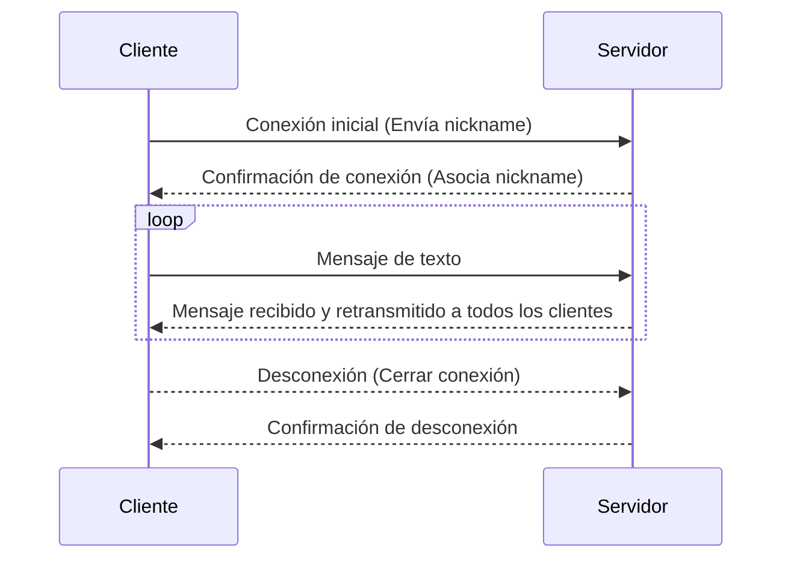
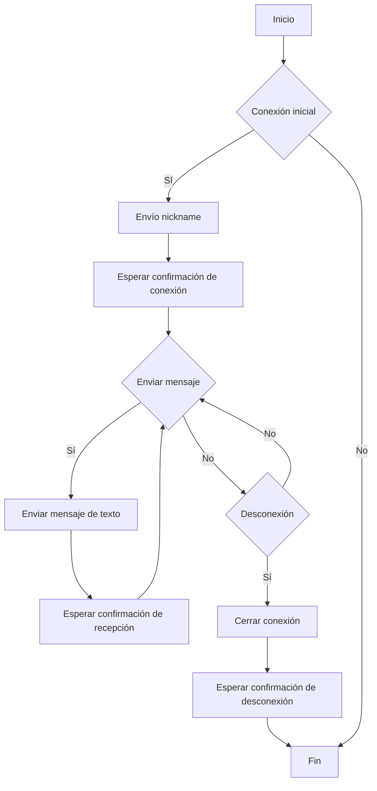

# Protocolo del chat
El protocolo de mi chat lo explico en dos diagramas, el de secuenia explica paso a paso lo que hace
cliente por un lado y lo que hace servidor por el otro. Mientras que el de flujo muestra como se mueve
el programa.
## Diagrama de secuencia
Este diagrama de secuencia describe el intercambio de mensajes entre los `cliente`
y el `servidor` durante el protocolo del chat.

#### Paso a Paso:

1. El cliente se conecta al servidor enviando su nickname.
2. El servidor confirma la conexión al cliente.
3. El cliente envía mensajes de texto al servidor.
4. El servidor retransmite los mensajes recibidos a todos los clientes conectados. 
5. El cliente cierra la conexión.
6. El servidor confirma la desconexión al cliente.

## Diagrama de flujo
Este diagrama de flujo proporciona una representación visual del flujo de acciones
que ocurren durante la interacción cliente/servidor en el protocolo del chat.

##### Explicacion

En este diagrama de flujo, las acciones comienzan con la "Conexión inicial" entre el 
cliente y el servidor. Luego, se verifica si la conexión se establece correctamente.
Si es así, el cliente envía su nickname y espera la confirmación de conexión. 
Después de establecer la conexión, el cliente puede enviar mensajes de texto al servidor.
Cada mensaje enviado se verifica para asegurarse de que se reciba correctamente. 
Luego, el cliente puede optar por desconectarse. Si decide desconectarse,
se cierra la conexión y se espera la confirmación de desconexión antes de finalizar el flujo.

